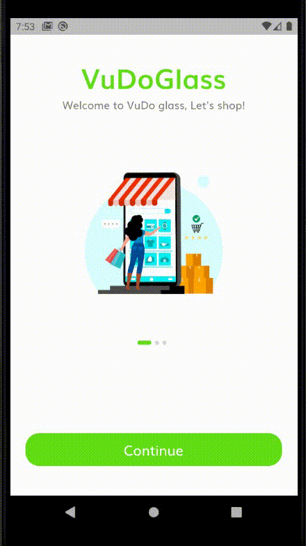
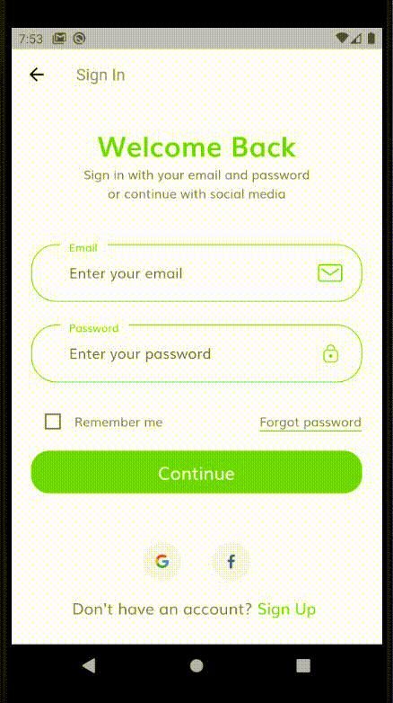

# VuDoGlass shop_app

An android shopping app demo with Firebase back-end.
Intergrated Oauth with Google and Facebook sign-in.
Utilize Shared-Preference to remember user credential.

## Getting Started

You need [Flutter](https://flutter.dev/) and [Graddle](https://gradle.org/) to build the app.

### Usage

## Built With

- [Flutter](https://img.shields.io/badge/Flutter-2.0-blue)
- [Firebase](https://firebase.google.com/)

## Authors

- **Dinh Vu** - *https://ogger77.github.io/*

## License

This project is licensed under the MIT License - see the [LICENSE.md](LICENSE.md) file for details.

## Acknowledgments

- UI design made by [The Flutter Way](https://www.youtube.com/channel/UCJm7i4g4z7ZGcJA_HKHLCVw).
